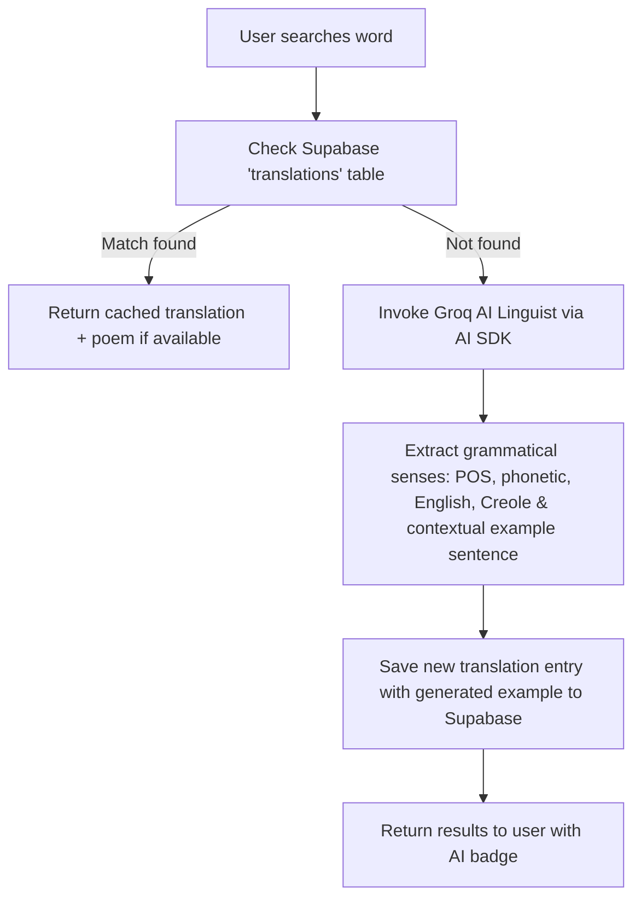

# Diksyone Ayisyen - English to Haitian Creole Dictionary

## Project Overview

Diksyone Ayisyen is a modern, interactive English to Haitian Creole dictionary web application built with Next.js 15. The application provides users with word translations, contextual example usage drawn from Haitian Creole poetry, and daily word features to enhance language learning.

**Target Users:** Language learners, educators, and Haitian Creole enthusiasts.

**Primary Features:**

- Real-time word search (English and Creole)
- AI-augmented translation lookup (Groq + Vercel AI SDK) with automatic database caching
- Contextual literary examples matched against a Haitian Creole poetry archive
- Date-seeded "Word of the Day" feature
- Responsive dark-theme UI with Shadcn UI components

---

## Tech Stack

### Frontend

- **Framework:** Next.js 15 (App Router with Turbopack)
- **React:** 19.1.0
- **Styling:** Tailwind CSS + PostCSS
- **UI Components:** Shadcn UI (built on Radix UI primitives)
- **Icons:** Lucide React
- **Theme Management:** Next Themes

### Backend, Database & AI

- **Database:** Supabase (PostgreSQL)
  - Tables: `translations`, `poems`
- **AI / LLM:** Vercel AI SDK (`ai`) with Groq (`@ai-sdk/groq`) running `meta-llama/llama-4-scout-17b-16e-instruct`
- **Schema Validation:** Zod

### Development & Testing

- **Testing:** Vitest (`npm test`)
- **Linting:** ESLint
- **Language:** TypeScript
- **Build Tool:** Turbopack

---

## Project Structure

Following Next.js App Router best practices with organized component and server action architecture:

```
diksyone-ayisyen/
├── public/                      # Static assets
│   └── images/                 # Image files
│
├── src/
│   ├── app/                    # Next.js App Router
│   │   ├── api/               # API routes
│   │   ├── translate/         # Translation routes
│   │   │   └── [word]/
│   │   │       ├── error.tsx  # Translation route error boundary
│   │   │       └── page.tsx   # Word translation & poetry result view
│   │   ├── layout.tsx         # Root layout with theme provider
│   │   ├── page.tsx           # Home / search landing page
│   │   └── globals.css        # Global styles & Tailwind
│   │
│   ├── components/            # Reusable React components
│   │   ├── SearchBar.tsx      # Search input component
│   │   ├── DictionaryEntry.tsx # Word entry display with poem citation
│   │   ├── TranslationCard.tsx # Translation pair card
│   │   ├── WordOfTheDay.tsx   # Daily word feature
│   │   ├── PoemsSection.tsx   # Poetry examples section
│   │   ├── PoemExample.tsx    # Individual poem display with highlighting
│   │   ├── ChallengeSection.tsx # Learning challenges
│   │   ├── figma/            # Design system components
│   │   │   └── ImageWithFallback.tsx
│   │   └── ui/               # Shadcn UI components library
│   │
│   ├── data/                  # Static data & fallbacks
│   │   └── dictionary-data.ts # Local dictionary definitions & types
│   │
│   ├── hooks/                 # Custom React hooks
│   │   └── use-mobile.ts     # Responsive layout hook
│   │
│   └── lib/                   # Server actions, clients & utilities
│       ├── actions.ts         # Server actions (getTranslation, getWordOfTheDay)
│       ├── actions.test.ts    # Vitest unit tests for server actions
│       ├── supabase.ts        # Supabase client instance
│       └── utils.ts          # Utility functions & classname merger
│
├── Configuration Files
│   ├── package.json
│   ├── tsconfig.json
│   ├── next.config.ts
│   ├── tailwind.config.ts
│   ├── postcss.config.mjs
│   ├── eslint.config.mjs
│   ├── vitest.config.ts
│   └── components.json        # Shadcn UI config
│
└── Documentation
    ├── README.md
    └── GEMINI.md (this file)
```

---

## Database Schema

The application uses Supabase with two interconnected tables:

### 1. `translations` table

- `id` (UUID, primary key)
- `english` (text, lowercase)
- `creole` (text, lowercase)
- `part_of_speech` (text)
- `pronunciation` (text)
- `example_sentence` (text, nullable)
- `poem_id` (UUID/text, foreign key to `poems.id`, nullable)
- `created_at` (timestamp)

### 2. `poems` table

- `id` (UUID, primary key)
- `title` (text)
- `author` (text)
- `content` (text, complete poem text)
- `created_at` (timestamp)

---

## Architecture & Data Flow

### 1. Translation Lookup & AI Fallback Pipeline (`getTranslation`)



### 2. Deterministic Word of the Day (`getWordOfTheDay`)

- Fetches all available word pairs from the `translations` table in Supabase.
- Computes a hash from the current date string (`YYYY-MM-DD`) to select a stable word index that automatically rotates once every 24 hours.

---

## Key Components & Features

### Components Architecture

| Component | Purpose | Location |
| :--- | :--- | :--- |
| **SearchBar** | Input for English or Creole terms; routes to `/translate/[word]` | `src/components/SearchBar.tsx` |
| **WordOfTheDay** | Displays date-seeded daily word with direct lookup navigation | `src/components/WordOfTheDay.tsx` |
| **DictionaryEntry** | Full translation card displaying phonetics, POS, and poetry citations | `src/components/DictionaryEntry.tsx` |
| **PoemExample** | Poem display with word highlighting and full-text expansion | `src/components/PoemExample.tsx` |
| **PoemsSection** | Container for poem examples | `src/components/PoemsSection.tsx` |
| **ChallengeSection** | Interactive learning quiz module | `src/components/ChallengeSection.tsx` |

---

## Development Guidelines

### Running the Project

```bash
# Install dependencies
npm install

# Run development server (with Turbopack)
npm run dev

# Run unit tests
npm test

# Build for production
npm run build

# Start production server
npm start

# Lint code
npm run lint
```

### Environment Variables

Ensure `.env.local` is configured with:

```env
NEXT_PUBLIC_SUPABASE_URL=your_supabase_url
NEXT_PUBLIC_SUPABASE_ANON_KEY=your_supabase_anon_key
GROQ_API_KEY=your_groq_api_key
```

### Code Style & Conventions

- **TypeScript:** Strict mode enabled; all component props and action returns explicitly typed.
- **Server Actions:** All database mutations and AI calls reside in `src/lib/actions.ts` marked with `"use server"`.
- **UI Components:** Use existing Shadcn UI components from `@/components/ui/` rather than rolling custom elements.
- **English Dictionary Conventions:** Store English verbs as bare infinitives (e.g. `plant` instead of `to plant`).
- **Styling:** Tailwind CSS utility classes; avoid inline styles.

---

## Localization Notes

- **Primary Language:** Haitian Creole (UI labels, placeholders, accents)
- **Secondary Language:** English (dictionary search and definitions)
- **Text Direction:** LTR (Left-to-Right)
- **Character Set:** UTF-8 compatible

---

## Notes for AI Coding Agent

**Important Context:**

- Always check `src/lib/actions.ts` before adding API routes; server actions are favored for data fetching and mutations.
- Search queries are case-insensitive and match against both `english` and `creole` columns.
- The AI Lexicographer uses `@ai-sdk/groq` with `Output.object` schemas to ensure structured output.
- When generating or inserting English verbs, ensure the leading `to ` is omitted.
